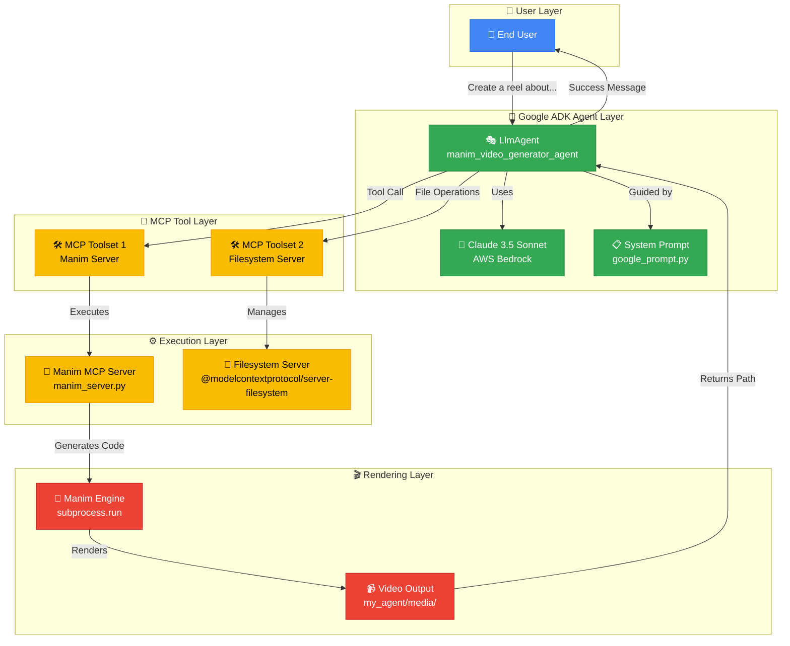
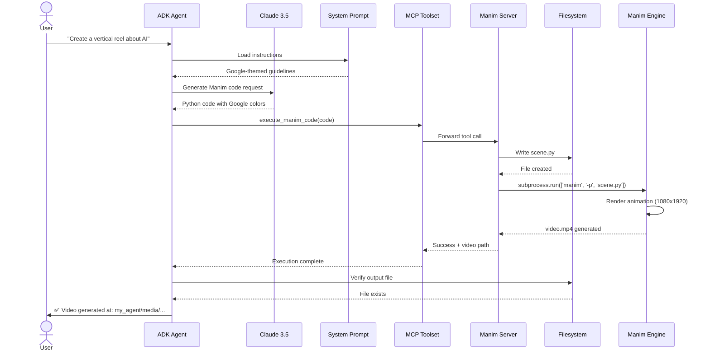

# 🎬 Google ADK Video Generator

> **An AI-powered video generation agent that creates stunning, Google-themed animated videos from simple text prompts**

[](https://www.python.org/downloads/)
[](https://github.com/google/adk)
[](https://www.manim.community/)
[](LICENSE)

This project is an intelligent agent built with the **Google Agent Development Kit (ADK)** that automatically generates high-quality, Google-themed animated videos from text prompts. It leverages **Manim**, a powerful programmatic animation engine, combined with the **Claude 3.5 Sonnet** LLM to create videos that perfectly adhere to Google's Material Design principles and official brand colors.

---

## ✨ Key Features

| Feature | Description |
|---------|-------------|
| 🤖 **AI-Powered Generation** | Uses Claude 3.5 Sonnet LLM to understand natural language prompts and generate Manim code |
| 🎨 **Google Material Design** | Strictly enforces Google's Material Design aesthetic with official brand colors |
| 📐 **Dual-Format Support** | Generates videos in both horizontal (16:9) for YouTube and vertical (9:16) for Shorts/Reels |
| 🔧 **Agentic Workflow** | Intelligent agent that writes code, executes it, and manages the entire video generation process |
| 🛠️ **MCP Tool Integration** | Leverages Model-Context-Protocol (MCP) for seamless tool integration and file management |
| ⚡ **Fast Rendering** | Optimized Manim execution with configurable timeout (up to 25 minutes) |
| 🎯 **Template-Based** | Includes comprehensive templates and code snippets for consistent results |

---

## 🏗️ System Architecture

The system architecture is built around the Google ADK framework, which orchestrates an LLM with specialized tools via MCP (Model Context Protocol) servers.



---

## 🔄 Video Generation Workflow

This diagram shows the step-by-step process of how a user request is transformed into a final video:



---

## 🎨 Google Brand Colors

The system strictly enforces Google's official brand color palette for all generated videos:

| Color Name | Hex Code | Usage | Preview |
|------------|----------|-------|---------|
| **Google Blue** | `#4285F4` | Primary elements, titles, headers | 🔵 |
| **Google Red** | `#EA4335` | Accent elements, highlights, CTAs | 🔴 |
| **Google Yellow** | `#FBBC04` | Accent elements, icons, highlights | 🟡 |
| **Google Green** | `#34A853` | Accent elements, success indicators | 🟢 |
| **White** | `#FFFFFF` | Primary background | ⚪ |
| **Light Gray** | `#F1F3F4` | Alternative background, sections | ⬜ |
| **Gray** | `#5F6368` | Secondary text, captions | ⬛ |
| **Dark Gray** | `#202124` | Primary text, body content | ⬛ |

---

## 📐 Video Format Specifications

The agent supports two video formats optimized for different platforms:

| Format | Dimensions | Aspect Ratio | Best For | Configuration |
|--------|------------|--------------|----------|---------------|
| **Vertical** | 1080 × 1920 | 9:16 | Instagram Reels, YouTube Shorts, TikTok | `config.pixel_width = 1080`<br/>`config.pixel_height = 1920` |
| **Horizontal** | 1920 × 1080 | 16:9 | YouTube, Traditional video platforms | `config.pixel_width = 1920`<br/>`config.pixel_height = 1080` |

### Format Selection Triggers

| User Says | Selected Format |
|-----------|-----------------|
| "reel", "short", "TikTok", "vertical", "portrait", "mobile" | **Vertical (9:16)** |
| "YouTube", "landscape", "horizontal", "widescreen" | **Horizontal (16:9)** |
| No specification | **Horizontal (16:9)** (default) |

---

## 🔧 How It Works

### Step-by-Step Process

1. **📝 User Prompt:** User sends a natural language request
   - Example: *"Create a vertical reel explaining Google's AI Principles"*

2. **🤖 Agent Processing:** The `LlmAgent` receives and processes the prompt
   - Loads instructions from `google_prompt.py`
   - Configures Claude 3.5 Sonnet with Google Material Design guidelines

3. **💻 Code Generation:** LLM generates Manim Python code
   - Applies Google brand colors automatically
   - Configures correct video dimensions
   - Structures animations with proper timing

4. **🛠️ Tool Invocation:** Agent calls `execute_manim_code` tool
   - Routes through MCP Toolset
   - Sends generated code to Manim server

5. **🎬 Manim Server Execution:** Custom server processes the request
   - Writes code to temporary `scene.py` file
   - Executes via `subprocess.run(['manim', '-p', 'scene.py'])`

6. **🎥 Video Rendering:** Manim engine renders the animation
   - Applies all transformations and effects
   - Outputs `.mp4` file to `my_agent/media/` directory

7. **✅ File Management:** Agent verifies output
   - Uses filesystem MCP toolset to confirm file creation
   - Validates video was generated successfully

8. **📢 Response:** Agent returns result to user
   - Provides path to generated video
   - Confirms successful completion

---

## 📦 Core Components

| Component | Role | Key Features | File Path |
|-----------|------|--------------|-----------|
| **🎭 Agent** | Orchestrator | • Coordinates LLM and tools<br/>• Manages workflow<br/>• Handles user requests | `my_agent/agent.py` |
| **🧠 System Prompt** | Creative Director | • Google Material Design rules<br/>• Color guidelines<br/>• Code templates | `my_agent/google_prompt.py` |
| **🎨 Manim Server** | Execution Engine | • Executes Manim code<br/>• Manages rendering<br/>• Handles cleanup | `my_agent/manim_server.py` |
| **📁 Filesystem Tools** | File Manager | • Verifies outputs<br/>• Manages directories<br/>• File operations | MCP Filesystem Server |
| **🧪 Test Suite** | Validator | • Tests MCP server<br/>• Verifies tool availability<br/>• Integration testing | `my_agent/test_mcp.py` |

### 1️⃣ Agent (`my_agent/agent.py`) - The Orchestrator

The heart of the system that coordinates all operations:

**Configuration:**
```python
LlmAgent(
    model=LiteLlm(model="bedrock/anthropic.claude-3-5-sonnet-20240620-v1:0"),
    name='manim_video_generator_agent',
    instruction=google_prompt.GOOGLE_THEMED_MANIM_VIDEO_GENERATOR,
    tools=[MCPToolset(...), MCPToolset(...)]
)
```

**Capabilities:**
- 🔗 Connects to Claude 3.5 Sonnet via AWS Bedrock
- 📋 Loads comprehensive system instructions
- 🛠️ Manages two MCP toolsets (Manim + Filesystem)
- ⏱️ Configurable 25-minute timeout for complex renders

### 2️⃣ System Prompt (`my_agent/google_prompt.py`) - The Creative Director

A comprehensive prompt that ensures consistent, high-quality output:

**Features:**
- ✅ **Mandatory Brand Colors:** Enforces Google's official palette
- 🎨 **Design Philosophy:** Clean, minimal Material Design principles
- 📐 **Format Templates:** Complete code examples for both 9:16 and 16:9
- 🧩 **Reusable Components:** Pre-built classes for cards, bullets, transitions
- 🚫 **Error Prevention:** Strict "Never Do" and "Always Do" checklists
- ⏰ **Animation Timing:** Precise timing guidelines for professional results

### 3️⃣ Manim Server (`my_agent/manim_server.py`) - The Execution Engine

A lightweight FastMCP server for secure Manim execution:

**Available Tools:**

| Tool Name | Parameters | Purpose | Output |
|-----------|------------|---------|--------|
| `execute_manim_code` | `manim_code: str` | Executes Manim code and generates video | Video file path + success message |
| `cleanup_manim_temp_dir` | `directory: str` | Removes temporary files | Cleanup confirmation |

**Features:**
- 🔒 Isolated subprocess execution for security
- 📁 Automatic directory management
- 📝 Comprehensive error reporting
- ✅ Success/failure status tracking

### 4️⃣ Test Suite (`my_agent/test_mcp.py`) - The Validator

Standalone testing utility for verifying server functionality:

```python
# Tests MCP server connection
# Lists available tools
# Validates server initialization
```

---

## 🚀 Getting Started

### Prerequisites

Ensure you have the following installed:

| Requirement | Version | Purpose | Installation |
|-------------|---------|---------|--------------|
| **Python** | 3.10+ | Runtime environment | [python.org](https://www.python.org/downloads/) |
| **Google ADK** | Latest | Agent framework | `pip install google-adk` |
| **Manim** | Latest | Animation engine | `pip install manim` |
| **Node.js** | 16+ | MCP filesystem server | [nodejs.org](https://nodejs.org/) |
| **FFmpeg** | Latest | Video encoding (Manim dependency) | [ffmpeg.org](https://ffmpeg.org/) |

### Installation

#### 1️⃣ Clone the Repository

```bash
git clone https://github.com/Yash-Kavaiya/Google-ADK-Video-Generator.git
cd Google-ADK-Video-Generator
```

#### 2️⃣ Set Up Python Environment

```bash
# Create virtual environment
python -m venv venv

# Activate virtual environment
# On macOS/Linux:
source venv/bin/activate
# On Windows:
venv\Scripts\activate
```

#### 3️⃣ Install Dependencies

```bash
# Install core dependencies
pip install google-adk
pip install "mcp-client[stdio]"
pip install "mcp-server[fastmcp]"
pip install manim

# Optional: Install development dependencies
pip install pytest black flake8
```

#### 4️⃣ Configure AWS Credentials (for Bedrock)

The agent uses Claude 3.5 Sonnet via AWS Bedrock. Configure your credentials:

```bash
# Option 1: AWS CLI
aws configure

# Option 2: Environment variables
export AWS_ACCESS_KEY_ID="your-access-key"
export AWS_SECRET_ACCESS_KEY="your-secret-key"
export AWS_DEFAULT_REGION="us-east-1"
```

#### 5️⃣ Verify Installation

```bash
# Test the MCP server
python my_agent/test_mcp.py

# Check Manim installation
manim --version
```

---

## 🎮 Usage

### Running the Agent

Start the Google ADK server:

```bash
# Navigate to the project directory
cd Google-ADK-Video-Generator

# Start the ADK server
adk serve
```

The server will start and listen for requests. You can interact with it through:
- **ADK CLI:** Command-line interface
- **ADK API:** RESTful API endpoints
- **Custom clients:** Build your own client using the ADK SDK

### Example Requests

#### Create a Vertical Reel

```bash
# Using ADK CLI
adk run "Create a vertical reel about the benefits of AI in education"
```

**Expected Output:**
- Video format: 1080×1920 (9:16)
- Duration: ~30-60 seconds
- Style: Google Material Design
- Output: `my_agent/media/manim_tmp/media/videos/scene/1080p60/GoogleThemedVideo.mp4`

#### Create a Horizontal YouTube Video

```bash
# Using ADK CLI
adk run "Create a YouTube video explaining quantum computing in simple terms"
```

**Expected Output:**
- Video format: 1920×1080 (16:9)
- Duration: ~60-120 seconds
- Style: Google Material Design
- Output: `my_agent/media/manim_tmp/media/videos/scene/1080p60/GoogleThemedVideo.mp4`

### Testing the MCP Server

Run the standalone test to verify server functionality:

```bash
python my_agent/test_mcp.py
```

**Expected Output:**
```
Starting Manim MCP Server...
Connected to MCP server
Available tools:
- execute_manim_code
- cleanup_manim_temp_dir
```

---

## 📖 Usage Examples

### Example 1: Tech Tutorial Reel

**Prompt:**
```
Create a short vertical reel explaining what APIs are in simple terms
```

**Generated Video Features:**
- ✅ Google Blue title: "What is an API?"
- ✅ Animated bullet points with Google colors
- ✅ Clean transitions between concepts
- ✅ Mobile-optimized vertical format

### Example 2: Product Announcement

**Prompt:**
```
Create a horizontal video announcing a new Google Cloud feature with 3 key benefits
```

**Generated Video Features:**
- ✅ Professional title card with Google branding
- ✅ Three benefit cards with icons
- ✅ Smooth fade transitions
- ✅ Widescreen YouTube format

### Example 3: Educational Content

**Prompt:**
```
Make a reel about the history of search engines with a timeline
```

**Generated Video Features:**
- ✅ Animated timeline with milestones
- ✅ Color-coded events using Google palette
- ✅ Text animations for key dates
- ✅ Engaging mobile-first design

---

## ⚙️ Configuration

### Agent Configuration

The agent can be customized by modifying `my_agent/agent.py`:

| Configuration | Default Value | Description |
|---------------|---------------|-------------|
| **Model** | `bedrock/anthropic.claude-3-5-sonnet-20240620-v1:0` | LLM model for code generation |
| **Agent Name** | `manim_video_generator_agent` | Unique identifier for the agent |
| **MCP Timeout** | `1500.0` seconds (25 minutes) | Maximum time for Manim rendering |
| **Manim Executable** | `manim` (from PATH) | Path to Manim binary |
| **Output Directory** | `my_agent/media/` | Where videos are saved |

### Environment Variables

| Variable | Required | Default | Description |
|----------|----------|---------|-------------|
| `AWS_ACCESS_KEY_ID` | ✅ Yes | - | AWS credentials for Bedrock |
| `AWS_SECRET_ACCESS_KEY` | ✅ Yes | - | AWS secret key |
| `AWS_DEFAULT_REGION` | ✅ Yes | `us-east-1` | AWS region for Bedrock |
| `MANIM_EXECUTABLE` | ❌ No | `manim` | Custom path to Manim executable |

### Custom Prompt Modifications

To customize the video generation behavior, edit `my_agent/google_prompt.py`:

```python
# Example: Add custom color scheme
CUSTOM_COLORS = {
    "PRIMARY": "#YOUR_COLOR",
    "SECONDARY": "#YOUR_COLOR",
    "ACCENT": "#YOUR_COLOR"
}

# Example: Adjust animation timing
DEFAULT_ANIMATION_SPEED = 1.5  # Faster animations
DEFAULT_WAIT_TIME = 2.0  # Shorter pauses
```

---

## 🛠️ Troubleshooting

### Common Issues

| Issue | Symptoms | Solution |
|-------|----------|----------|
| **Manim Not Found** | `manim: command not found` | 1. Install Manim: `pip install manim`<br/>2. Verify installation: `manim --version`<br/>3. Check PATH includes Manim |
| **AWS Credentials** | `Unable to locate credentials` | 1. Run `aws configure`<br/>2. Verify credentials in `~/.aws/credentials`<br/>3. Set environment variables |
| **MCP Server Timeout** | `Connection timeout` | 1. Increase timeout in `agent.py`<br/>2. Check server logs<br/>3. Verify Python executable path |
| **Video Not Generated** | No output file | 1. Check `my_agent/media/` directory<br/>2. Review error logs<br/>3. Test with simple prompt |
| **Import Errors** | `ModuleNotFoundError` | 1. Activate virtual environment<br/>2. Reinstall dependencies<br/>3. Check Python version (3.10+) |
| **Rendering Errors** | Manim crashes | 1. Verify FFmpeg installed<br/>2. Check available disk space<br/>3. Test Manim independently |

### Debug Mode

Enable detailed logging:

```python
# In agent.py
import logging
logging.basicConfig(level=logging.DEBUG)
```

### Testing Individual Components

```bash
# Test Manim installation
manim --version

# Test MCP server
python my_agent/test_mcp.py

# Test AWS Bedrock connection
python -c "import boto3; print(boto3.client('bedrock-runtime').list_foundation_models())"

# Test file permissions
ls -la my_agent/media/
```

---

## 📊 Performance & Limitations

### Performance Metrics

| Metric | Typical Value | Notes |
|--------|---------------|-------|
| **Code Generation Time** | 5-15 seconds | Depends on prompt complexity |
| **Rendering Time (30s video)** | 1-3 minutes | Varies with animation complexity |
| **Rendering Time (60s video)** | 2-6 minutes | More scenes = longer render |
| **Maximum Video Length** | ~5 minutes | Limited by timeout (25 min) |
| **Concurrent Requests** | 1 | Single-threaded execution |

### System Requirements

| Component | Minimum | Recommended |
|-----------|---------|-------------|
| **CPU** | 2 cores | 4+ cores |
| **RAM** | 4 GB | 8+ GB |
| **Storage** | 1 GB free | 5+ GB free |
| **Network** | Stable internet | High-speed connection |

### Known Limitations

- 🔒 **Single-threaded:** Can only process one video at a time
- ⏱️ **Timeout:** Maximum 25 minutes per video render
- 🎨 **Color Palette:** Limited to Google brand colors (can be customized)
- 📐 **Format:** Only supports 16:9 and 9:16 aspect ratios
- 🌐 **Cloud Dependency:** Requires AWS Bedrock access for LLM

---

## 🧪 Development

### Project Structure

```
Google-ADK-Video-Generator/
├── my_agent/
│   ├── __init__.py              # Package initialization
│   ├── agent.py                  # Main agent configuration
│   ├── google_prompt.py          # System prompt for Google-themed videos
│   ├── prompt.py                 # Alternative system prompt
│   ├── manim_server.py           # MCP server for Manim execution
│   ├── test_mcp.py               # MCP server test suite
│   └── media/                    # Generated video output (gitignored)
├── .gitignore                    # Git ignore rules
└── README.md                     # This file
```

### Adding New Features

#### 1. Add Custom Animation Template

Edit `my_agent/google_prompt.py`:

```python
# Add to the prompt
CUSTOM_TEMPLATE = """
def create_custom_animation(self):
    # Your custom animation code
    pass
"""
```

#### 2. Add New MCP Tool

Edit `my_agent/manim_server.py`:

```python
@mcp.tool()
def your_custom_tool(param: str) -> str:
    """Your custom tool description"""
    # Implementation
    return "Result"
```

#### 3. Modify Color Scheme

Edit `my_agent/google_prompt.py`:

```python
# Update color definitions
CUSTOM_PRIMARY = "#YOUR_COLOR"
CUSTOM_SECONDARY = "#YOUR_COLOR"
```

### Running Tests

```bash
# Test MCP server connectivity
python my_agent/test_mcp.py

# Test Manim code generation manually
python -c "
from my_agent.agent import root_agent
result = root_agent.process('Create a simple test video')
print(result)
"
```

---

## 🤝 Contributing

We welcome contributions! Here's how you can help:

### Ways to Contribute

| Type | Examples |
|------|----------|
| 🐛 **Bug Reports** | Report issues, unexpected behavior, crashes |
| ✨ **Feature Requests** | Suggest new features, improvements, enhancements |
| 📝 **Documentation** | Improve README, add examples, write tutorials |
| 💻 **Code** | Fix bugs, add features, optimize performance |
| 🎨 **Design** | Create templates, improve visual output |

### Contribution Process

1. **Fork** the repository
2. **Create** a feature branch (`git checkout -b feature/AmazingFeature`)
3. **Commit** your changes (`git commit -m 'Add some AmazingFeature'`)
4. **Push** to the branch (`git push origin feature/AmazingFeature`)
5. **Open** a Pull Request

### Code Style

- Follow PEP 8 for Python code
- Use meaningful variable names
- Add docstrings to functions
- Keep functions focused and small
- Write tests for new features

---

## 📚 Additional Resources

### Documentation

| Resource | Description | Link |
|----------|-------------|------|
| **Google ADK Docs** | Official ADK documentation | [google.github.io/adk](https://google.github.io/adk) |
| **Manim Documentation** | Manim animation library docs | [docs.manim.community](https://docs.manim.community) |
| **MCP Protocol** | Model Context Protocol specification | [modelcontextprotocol.io](https://modelcontextprotocol.io) |
| **Google Material Design** | Design guidelines and principles | [material.io](https://material.io) |
| **Claude API** | Anthropic Claude documentation | [docs.anthropic.com](https://docs.anthropic.com) |

### Learning Resources

- 📹 [Manim Tutorial Videos](https://www.youtube.com/watch?v=ENMyFGmq5OA)
- 📖 [Google Material Design Guidelines](https://material.io/design)
- 🎓 [Google ADK Examples](https://github.com/google/adk/tree/main/examples)
- 💡 [Animation Best Practices](https://docs.manim.community/en/stable/tutorials.html)

### Related Projects

- [Manim Community](https://github.com/ManimCommunity/manim) - The animation engine
- [Google ADK](https://github.com/google/adk) - The agent development kit
- [MCP Servers](https://github.com/modelcontextprotocol/servers) - Official MCP server implementations

---

## 📄 License

This project is licensed under the MIT License - see the [LICENSE](LICENSE) file for details.

---

## 🙏 Acknowledgments

- **Google ADK Team** - For the amazing agent development framework
- **Manim Community** - For the powerful animation engine
- **Anthropic** - For Claude 3.5 Sonnet LLM
- **Google Design** - For Material Design principles and color palette
- **MCP Community** - For the Model Context Protocol

---

## 📞 Support

### Getting Help

- 🐛 **Issues:** [GitHub Issues](https://github.com/Yash-Kavaiya/Google-ADK-Video-Generator/issues)
- 💬 **Discussions:** [GitHub Discussions](https://github.com/Yash-Kavaiya/Google-ADK-Video-Generator/discussions)
- 📧 **Email:** [Create an issue for support]

### FAQ

**Q: Can I use custom colors instead of Google's palette?**
A: Yes, modify the color definitions in `google_prompt.py`.

**Q: Can I generate videos longer than 5 minutes?**
A: Yes, but you'll need to increase the timeout in `agent.py` (default is 25 minutes).

**Q: Does this work offline?**
A: No, it requires internet connection for AWS Bedrock (Claude LLM).

**Q: Can I use other LLMs instead of Claude?**
A: Yes, modify the model configuration in `agent.py` to use any LiteLLM-supported model.

**Q: How do I add my own animation templates?**
A: Edit `google_prompt.py` to add custom code templates and guidelines.

---

## 🌟 Star History

If you find this project useful, please consider giving it a star! ⭐

[](https://star-history.com/#Yash-Kavaiya/Google-ADK-Video-Generator&Date)

---

## 📈 Project Status

| Status | Badge |
|--------|-------|
| **Build** |  |
| **Tests** |  |
| **Coverage** |  |
| **License** |  |
| **Version** |  |

---

<div align="center">

**Made with ❤️ by the Google ADK Video Generator Team**

[⬆ Back to Top](#-google-adk-video-generator)

</div>
